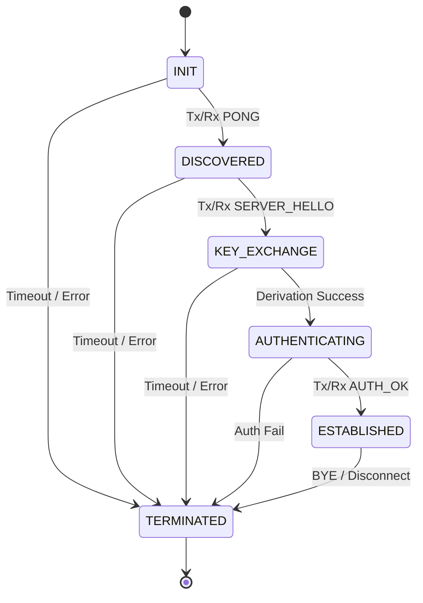

# PPCP Protocol Diagram

## Full Connection Lifecycle

```plain
CLIENT                                          SERVER
  │                                               │
  │       ── PHASE 1: DISCOVERY ──                │
  │                                               │
  │  [scan LAN, try each IP on configured port]   │
  │                                               │
  │─────────────── PING ─────────────────────────▶│
  │  { version, client_id, hostname }             │
  │                                               │  verify version
  │◀──────────────── PONG ────────────────────────│
  │  { server_id, capabilities, public_info }     │
  │                                               │
  │       ── PHASE 2: KEY EXCHANGE ──             │
  │                                               │
  │  client_kp = ECDHKeyPair()  [ephemeral]       │
  │  nonce_c = random 32-byte                     │
  │─────── CLIENT_HELLO (raw bytes) ─────────────▶│  
  │  [pub_len][client_pub][nonce_c]               │
  │                                               │  server_kp = ECDHKeyPair() [ephemeral]
  │                                               │  nonce_s = random 32-byte
  │                                               │  sig = HMAC(psk, server_pub | nonce_s)
  │◀───── SERVER_HELLO (raw bytes) ───────────────│  
  │  [pub_len][server_pub][nonce_s][sig]          │
  │                                               │
  │  verify HMAC(psk, server_pub | nonce_s) == sig│
  │  → proves server owns pre-shared key          │
  │  → protects against MITM substitution         │
  │                                               │
  │  [Both independently derive Session Key]      │
  │  shared = ECDH(client_priv, server_pub)       │
  │  salt   = client_pub[:32] XOR server_pub[:32] │
  │  context = "ppcp/1.0" | nonce_c | nonce_s     │
  │             | client_pub | server_pub         │
  │  key = HKDF-SHA256(shared, salt, info=context)│
  │                                               │
  │       ── PHASE 3: AUTHENTICATION ──           │
  │                                               │
  │  proof_c = HMAC(session_key, nonce_s)         │
  │─────────────── AUTH ─────────────────────────▶│
  │  { proof: proof_c }                           │  verify HMAC(session_key, nonce_s)
  │                                               │  → proves client derived same key
  │                                               │
  │  proof_s = HMAC(session_key, nonce_c)         │
  │◀──────────────── AUTH_OK ─────────────────────│  
  │  { proof: proof_s }                           │  verify HMAC(...) 
  │                                               │
  │       ── PHASE 4: ENCRYPTED CHANNEL ──        │
  │                                               │
  │══════════ AES-256-GCM traffic ════════════════│
  │  [4B len][12B nonce][ciphertext][16B GCM tag] │
  │                                               │
  │─────────── HEARTBEAT ────────────────────────▶│  
  │◀───────── HEARTBEAT_ACK ──────────────────────│
  │                                               │
  │◀──────────── COMMAND ─────────────────────────│  { cmd: "whoami" }
  │─────────── RESPONSE ─────────────────────────▶│  { output: "user" }
  │                                               │
  │──────── FILE_REQUEST ────────────────────────▶│  { path, offset, length }
  │◀──────── FILE_CHUNK x N ──────────────────────│  { index, data (base64) }
  │                                               │
  │─────────── BYE ──────────────────────────────▶│  graceful shutdown
  │                                               │
```

---

## Security Properties

| Property           | Mechanism                                         |
| ------------------ | ------------------------------------------------- |
| Peer discovery     | TCP port scan + PING/PONG                         |
| Key secrecy        | Ephemeral ECDH (P-256)                            |
| Key derivation     | HKDF-SHA256 (context bound to nonces & pub keys)  |
| MITM protection    | HMAC of server material with long-term PSK identity |
| Mutual auth        | AUTH/AUTH_OK: parties prove possession of derived key |
| Message encryption | AES-256-GCM (confidentiality + integrity)         |
| Message framing    | 4-byte big-endian length prefix                   |

---

## Session State Machine



---

## Message Types

| Type            | Direction       | Purpose                         |
| --------------- | --------------- | ------------------------------- |
| `ping`          | Client → Server | Announce presence, send version |
| `pong`          | Server → Client | Respond with capabilities / info|
| `client_hello`  | Client → Server | (Raw) Send ECDH Key & Nonce C   |
| `server_hello`  | Server → Client | (Raw) Send ECDH Key & Nonce S   |
| `auth`          | Client → Server | Send HMAC proof of Session Key  |
| `auth_ok`       | Server → Client | Send HMAC proof & Auth accept   |
| `auth_fail`     | Server → Client | Authentication rejected         |
| `heartbeat`     | Both            | Keep connection alive           |
| `heartbeat_ack` | Both            | Acknowledge heartbeat           |
| `command`       | Server → Client | Execute shell command           |
| `response`      | Client → Server | Return command output           |
| `file_request`  | Both            | Request file or specific chunk  |
| `file_chunk`    | Both            | Data transfer                   |
| `error`         | Either          | Signal an error condition       |
| `bye`           | Either          | Graceful connection termination |

---

## Module Map

```text
ppcp/
├── core/           Message, Session, SessionState, ProtocolConfig, exceptions
├── crypto/         Crypto (AES-GCM), HMAC, key utilities
├── key_exchange/   ECDHKeyPair, HKDF, raw byte exchange routines
├── handshake/      PING/PONG, session state orchestrator
├── discovery/      PING/PONG message factories, LAN scanner
├── transport/      TCP/UDP socket helpers, framed send/recv
├── control/        Command factories, executor, file transfer, router
└── utils/          Logger, JSON serializer, time helpers
```
