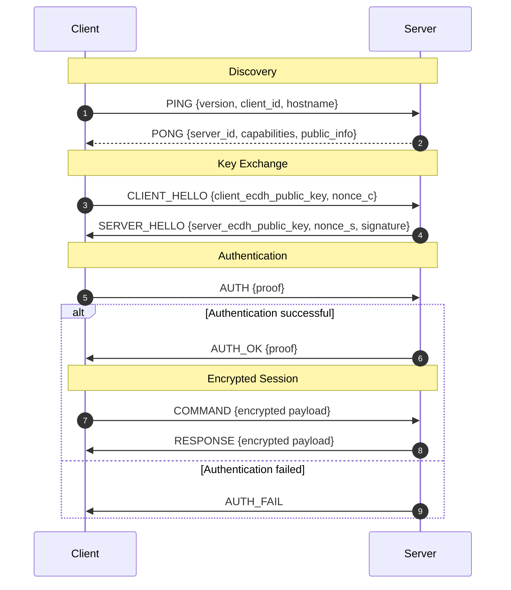

# PPCP: Ping-Pong Communication Protocol (PPCP)

**Specification Document**  
**Status:** Experimental / Informational  
**Version:** 1.0  
**Date:** 2025-04-14

## Abstract

PPCP (Ping-Pong Communication Protocol) is a lightweight LAN-oriented protocol for node discovery, authenticated session establishment, and encrypted client-server communication. PPCP is designed for environments where the client does not know the server's IP address or session key in advance. The protocol supports broadcast discovery, ephemeral key exchange, mutual authentication, and encrypted message exchange over a reliable or unreliable transport.

PPCP is primarily intended for local network discovery and secure control-channel establishment. It is not tied to a specific transport implementation and may be carried over UDP, TCP, or a transport suitable for broadcast and bidirectional communication.

## Status of This Memo

This document is a protocol draft written in Markdown for implementation and documentation purposes. It does not define an Internet Standard.

## 1. Terminology

The key words **MUST**, **MUST NOT**, **REQUIRED**, **SHALL**, **SHALL NOT**, **SHOULD**, **SHOULD NOT**, **RECOMMENDED**, **MAY**, and **OPTIONAL** in this document are to be interpreted as described in RFC 2119.

### 1.1 Definitions

**Client**  
An endpoint that initiates discovery and session establishment.

**Server**  
An endpoint that responds to discovery requests and accepts authenticated sessions.

**Node**  
Either a client or a server participating in PPCP.

**Session**  
An authenticated, encrypted communication context established between a client and a server.

**Nonce**  
A cryptographically random value used once for a specific purpose.

**Shared Secret**  
A cryptographic secret derived by both parties during key exchange.

**Control Message**  
An encrypted PPCP message used after session establishment.

## 2. Overview

PPCP consists of four phases:

1. **Discovery** - the client broadcasts a discovery request to locate servers.
2. **Key Exchange** - the client and server establish shared session keys.
3. **Authentication** - each party proves possession of the derived key material.
4. **Encrypted Communication** - the parties exchange encrypted messages.

The protocol is designed to be:

- lightweight,
- suitable for local networks,
- secure by default,
- extensible for future message types.

## 3. Design Goals

PPCP is designed with the following goals:

- Discover servers without preconfigured IP addresses.
- Establish encrypted communication without a pre-shared symmetric key.
- Resist passive interception.
- Support mutual authentication after key exchange.
- Keep the wire format compact and deterministic.
- Allow future extension without breaking backward compatibility.

## 4. Protocol Model

PPCP is a request/response protocol with optional broadcast discovery.

### 4.1 Transport Assumptions

PPCP messages MAY be transported over UDP, TCP, or another message-oriented transport. The discovery phase is RECOMMENDED to use broadcast or multicast on a local network. The encrypted session phase SHOULD use a transport that preserves message boundaries or provides a clear framing mechanism.

### 4.2 Session Lifecycle

A session progresses through the following states:

- `INIT`
- `DISCOVERED`
- `KEY_EXCHANGE`
- `AUTHENTICATING`
- `ESTABLISHED`
- `TERMINATED`

A node MUST NOT send encrypted control messages before the session reaches the `ESTABLISHED` state.

## 5. Wire Format

### 5.1 Outer Frame

Each PPCP message MUST be framed using the following binary envelope:

```text
[4 bytes big-endian length][12 bytes nonce][ciphertext][16 bytes AES-GCM tag]
```

Where:

- `length` is the total length of the encrypted payload section, encoded as an unsigned 32-bit big-endian integer.
- `nonce` is a 12-byte value used by AES-GCM.
- `ciphertext` is the encrypted JSON payload.
- `tag` is the 16-byte AES-GCM authentication tag.

The `length` field MUST represent the size of the encrypted section that follows it, excluding the `length` field itself.

### 5.2 Payload Format

The encrypted payload MUST be a UTF-8 encoded JSON object with the following structure:

```json
{
  "v": 1,
  "t": "MESSAGE_TYPE",
  "p": {},
  "i": "message-id",
  "s": 1713080000
}
```

### 5.3 Payload Fields

- `v` - protocol version. This document defines version `1`.
- `t` - message type.
- `p` - payload content. MAY be a string, object, array, or null depending on message type.
- `i` - message identifier. SHOULD be unique within a session.
- `s` - timestamp in Unix seconds.

A receiver MUST reject messages with an unsupported protocol version unless a compatibility mode is explicitly enabled.

## 6. Message Types

### 6.1 Discovery Messages

- `PING`
- `PONG`

### 6.2 Key Exchange Messages

- `CLIENT_HELLO`
- `SERVER_HELLO`

> *Note: While defined generally in this RFC, implementations MAY transmit key exchange material strictly as tightly packed raw byte frames rather than wrapped JSON overheads, immediately bypassing potential JSON deserialization vulnerability vectors prior to full authentication.*

### 6.3 Authentication Messages

- `AUTH`
- `AUTH_OK`
- `AUTH_FAIL`

### 6.4 Session Messages

- `HEARTBEAT`
- `HEARTBEAT_ACK`
- `COMMAND`
- `RESPONSE`
- `FILE_REQUEST`
- `FILE_CHUNK`
- `ERROR`
- `BYE`

### 6.5 Reserved Types

Implementations MUST ignore unknown message types only if the protocol version defines forward-compatible handling. Otherwise, unknown types MUST result in an `ERROR` response or session termination.

## 7. Discovery Phase

### 7.1 Purpose

Discovery allows a client to locate PPCP servers on the local network without prior knowledge of their IP address.

### 7.2 PING

The client MUST broadcast or multicast a `PING` message.

Example payload:

```json
{
  "v": 1,
  "t": "PING",
  "p": {
    "client_id": "c7b1f7f1-2d6d-4c3e-91c6-9f16d7e8f401",
    "hostname": "workstation-01",
    "version": "1.0.0"
  },
  "i": "00000001",
  "s": 1713080000
}
```

The `PING` payload SHOULD include:

- `client_id`
- `hostname`
- client implementation version

A server receiving `PING` MAY respond if it supports PPCP and is configured to accept discovery traffic.

### 7.3 PONG

A server responding to discovery MUST send `PONG`.

Example payload:

```json
{
  "v": 1,
  "t": "PONG",
  "p": {
    "server_id": "srv-01",
    "hostname": "node-01",
    "capabilities": ["key-exchange", "aes-gcm", "file-transfer"],
    "public_info": {
      "port": 9000,
      "protocol": "ppcp/1"
    }
  },
  "i": "00000002",
  "s": 1713080001
}
```

A `PONG` SHOULD contain enough information for the client to initiate the next phase.

### 7.4 Discovery Constraints

Discovery messages MUST NOT contain secret material. Discovery is assumed to be observable by any node on the local network.

## 8. Key Exchange Phase

### 8.1 Purpose

The key exchange phase establishes shared session key material without requiring a pre-shared symmetric key.

### 8.2 Recommended Algorithm

PPCP RECOMMENDS using ECDH with a modern curve suitable for ephemeral key agreement. The exact curve is implementation-defined, but both sides MUST agree on the same algorithm before key exchange can succeed.

### 8.3 CLIENT_HELLO

The client initiates key exchange with `CLIENT_HELLO`.

Example payload:

```json
{
  "v": 1,
  "t": "CLIENT_HELLO",
  "p": {
    "client_ecdh_public_key": "BASE64-ENCODED-BYTES",
    "nonce_c": "BASE64-ENCODED-BYTES"
  },
  "i": "00000003",
  "s": 1713080002
}
```

The payload SHOULD include:

- the client ephemeral public key,
- a client nonce.

### 8.4 SERVER_HELLO

The server responds with `SERVER_HELLO`.

Example payload:

```json
{
  "v": 1,
  "t": "SERVER_HELLO",
  "p": {
    "server_ecdh_public_key": "BASE64-ENCODED-BYTES",
    "nonce_s": "BASE64-ENCODED-BYTES",
    "signature": "BASE64-ENCODED-BYTES"
  },
  "i": "00000004",
  "s": 1713080003
}
```

The server SHOULD sign the key exchange material if it has a long-term identity key. If no identity system exists, the server MAY omit the signature field, but doing so reduces resistance to man-in-the-middle attacks.

### 8.5 Shared Secret Derivation

After exchanging public keys, both parties MUST derive the same shared secret using the agreed ECDH algorithm.

The derived secret MUST NOT be used directly as an encryption key. Instead, it MUST be passed through a key derivation function.

Recommended derivation:

```text
shared_secret = ECDH(private_key, peer_public_key)
session_key = HKDF(shared_secret, context)
```

The `context` SHOULD include:

- protocol name,
- protocol version,
- client nonce,
- server nonce,
- both public keys.

### 8.6 Key Separation

Implementations SHOULD derive separate keys for:

- encryption,
- authentication,
- optional rekeying.

A single raw secret SHOULD NOT be reused across unrelated cryptographic functions.

## 9. Authentication Phase

### 9.1 Purpose

Authentication proves that both parties possess the same derived key material and have not been trivially substituted by an unauthenticated intermediary.

### 9.2 AUTH

The client MUST send `AUTH` after deriving the session key.

Example payload:

```json
{
  "v": 1,
  "t": "AUTH",
  "p": {
    "proof": "HMAC-OR-SIMILAR-PROOF"
  },
  "i": "00000005",
  "s": 1713080004
}
```

The proof SHOULD bind to the server nonce and session context.

### 9.3 AUTH_OK

If the proof is valid, the server MUST respond with `AUTH_OK`.

Example payload:

```json
{
  "v": 1,
  "t": "AUTH_OK",
  "p": {
    "proof": "HMAC-OR-SIMILAR-PROOF"
  },
  "i": "00000006",
  "s": 1713080005
}
```

The server proof SHOULD bind to the client nonce and session context.

### 9.4 AUTH_FAIL

If authentication fails, the server MUST send `AUTH_FAIL` or terminate the session immediately.

Example payload:

```json
{
  "v": 1,
  "t": "AUTH_FAIL",
  "p": {
    "reason": "invalid-proof"
  },
  "i": "00000007",
  "s": 1713080006
}
```

After `AUTH_FAIL`, the session MUST be considered terminated.

## 10. Encrypted Communication Phase

### 10.1 General Rules

Once a session is established, all application messages MUST be encrypted and authenticated using AES-GCM or an equivalent authenticated encryption scheme.

### 10.2 Confidentiality and Integrity

Implementations MUST ensure:

- message confidentiality,
- message integrity,
- message authenticity,
- nonce uniqueness per encryption key.

### 10.3 Message Types in Established Sessions

The following message types MAY be used after authentication:

- `HEARTBEAT`
- `HEARTBEAT_ACK`
- `COMMAND`
- `RESPONSE`
- `FILE_REQUEST`
- `FILE_CHUNK`
- `ERROR`
- `BYE`

### 10.4 HEARTBEAT

A heartbeat MAY be used to confirm liveness.

Example:

```json
{
  "v": 1,
  "t": "HEARTBEAT",
  "p": {
    "ts": 1713080010
  },
  "i": "00000008",
  "s": 1713080010
}
```

### 10.5 HEARTBEAT_ACK

The peer MAY reply with `HEARTBEAT_ACK`.

### 10.6 COMMAND and RESPONSE

`COMMAND` MAY be used for authenticated application-level actions.

Example:

```json
{
  "v": 1,
  "t": "COMMAND",
  "p": {
    "name": "status",
    "args": {}
  },
  "i": "00000009",
  "s": 1713080011
}
```

A receiver MUST validate that the command is allowed by the current session policy.

A `RESPONSE` message SHOULD contain the result of the command.

### 10.7 FILE_REQUEST and FILE_CHUNK

`FILE_REQUEST` MAY request a file or file segment from the peer, subject to authorization.

Example request:

```json
{
  "v": 1,
  "t": "FILE_REQUEST",
  "p": {
    "path": "logs/app.log",
    "offset": 0,
    "length": 65536
  },
  "i": "00000010",
  "s": 1713080012
}
```

`FILE_CHUNK` SHOULD carry encrypted file data in chunks.

### 10.8 BYE

Either peer MAY terminate a session by sending `BYE`.

After sending or receiving `BYE`, the session MUST transition to `TERMINATED`.

## 11. Error Handling

### 11.1 General

Implementations SHOULD fail closed. If a message cannot be decoded, authenticated, or validated, the receiver SHOULD discard it and MAY log the event.

### 11.2 ERROR Message

An `ERROR` message MAY be used to report protocol-level errors.

Example:

```json
{
  "v": 1,
  "t": "ERROR",
  "p": {
    "code": "invalid-nonce",
    "message": "Nonce reuse detected"
  },
  "i": "00000011",
  "s": 1713080013
}
```

### 11.3 Error Codes

Implementations MAY define the following error codes:

- `unsupported-version`
- `invalid-message`
- `invalid-nonce`
- `authentication-failed`
- `unauthorized`
- `decryption-failed`
- `session-expired`
- `rate-limited`
- `internal-error`

## 12. Session State Machine

### 12.1 States

A PPCP node MUST maintain a session state machine.

#### `INIT`

No active session exists.

#### `DISCOVERED`

A peer has been discovered.

#### `KEY_EXCHANGE`

Key exchange is in progress.

#### `AUTHENTICATING`

The peer is proving possession of session key material.

#### `ESTABLISHED`

Encrypted messages may be exchanged.

#### `TERMINATED`

The session is no longer valid.

### 12.2 State Transitions

- `INIT -> DISCOVERED` on `PONG`
- `DISCOVERED -> KEY_EXCHANGE` on `CLIENT_HELLO`
- `KEY_EXCHANGE -> AUTHENTICATING` on successful secret derivation
- `AUTHENTICATING -> ESTABLISHED` on successful authentication
- any state -> `TERMINATED` on fatal error, timeout, or `BYE`

Invalid transitions MUST be rejected.

## 13. Security Considerations

### 13.1 Key Exchange Security

Ephemeral key exchange MUST be used if forward secrecy is desired. Static keys SHOULD NOT be used for session encryption unless the security implications are understood and accepted.

### 13.2 Nonce Reuse

Nonce reuse with the same encryption key is catastrophic for AES-GCM. Implementations MUST ensure that each nonce is unique per key.

### 13.3 Replay Protection

Implementations SHOULD reject replayed handshake messages and MAY maintain a replay cache for recently seen nonces or message identifiers.

### 13.4 Authentication

Discovery alone does not provide authentication. A `PONG` response MUST NOT be treated as proof of identity. Authentication MUST occur after key exchange.

### 13.5 Man-in-the-Middle Attacks

If the server identity is not anchored by a signature, certificate, or other trust mechanism, the protocol is vulnerable to active interception during initial key exchange. Implementations SHOULD provide a trust model for server identity when security matters.

### 13.6 Transport Security

PPCP encrypts payload data at the protocol layer. Transport-layer security MAY be used in addition, but it is not a replacement for correct PPCP cryptography.

### 13.7 Authorization

Authentication does not imply authorization. A peer MAY be authenticated but still forbidden from certain commands or file requests.

### 13.8 Logging

Sensitive data such as raw keys, nonces, and plaintext payloads MUST NOT be logged in production.

## 14. Implementation Notes

### 14.1 JSON Canonicalization

Because JSON object key ordering may vary, implementations SHOULD use a deterministic encoding or canonicalization step when computing proofs or signatures.

### 14.2 Message IDs

Message identifiers SHOULD be unique within a session and MAY be monotonically increasing or random.

### 14.3 Timestamps

Timestamps are RECOMMENDED for debugging and replay detection, but implementations MUST NOT rely solely on timestamps for security decisions.

### 14.4 Timeouts

Implementations SHOULD apply reasonable timeouts to discovery, key exchange, and authentication phases to avoid resource exhaustion.

### 14.5 Fragmentation

If a transport does not preserve message boundaries, the outer length field MUST be used to reconstruct complete messages before decryption.

## 15. Extensibility

PPCP is designed to be extensible.

### 15.1 Versioning

The `v` field identifies the protocol version. Implementations MUST reject incompatible major versions unless compatibility support is explicitly implemented.

### 15.2 Capability Negotiation

A server MAY advertise capabilities during discovery. Clients MAY select features based on the server's capability set.

### 15.3 New Message Types

New message types SHOULD be introduced in a backward-compatible way. Unknown message types MUST NOT crash an implementation.

## 16. Example Handshake

The following example shows a typical PPCP flow.

### 16.1 Discovery

Client broadcasts `PING`.

Server responds with `PONG`.

### 16.2 Key Exchange

Client sends `CLIENT_HELLO` with ephemeral public key and nonce.

Server sends `SERVER_HELLO` with its ephemeral public key, nonce, and optional signature.

### 16.3 Authentication

Client sends `AUTH` proof.

Server replies `AUTH_OK`.

### 16.4 Encrypted Session

Client and server exchange encrypted `COMMAND`, `RESPONSE`, `HEARTBEAT`, and other authorized messages.

## 17. Example Sequence Diagram



## 18. Recommended Cryptographic Primitives

The protocol is algorithm-agnostic at the specification level, but the following are RECOMMENDED:

- Key exchange: ECDH
- Key derivation: HKDF
- Authenticated encryption: AES-GCM
- Authentication proof: HMAC over session context

Implementations MUST use cryptographically secure random number generation.

## 19. Compatibility Considerations

Implementations SHOULD be strict in what they accept and precise in what they generate.

A node MAY support future versions by negotiating features, but it MUST NOT silently downgrade security properties.

## 20. Future Work

Future versions of PPCP MAY define:

- session resumption,
- server clustering,
- peer-to-peer mode,
- multi-node discovery routing,
- key rotation,
- offline provisioning,
- certificate-based identity.

## 21. IANA Considerations

This document does not request any IANA actions.

## 22. References

- RFC 2119 - Key words for use in RFCs to Indicate Requirement Levels
- RFC 5869 - HMAC-based Extract-and-Expand Key Derivation Function (HKDF)
- RFC 8446 - The Transport Layer Security (TLS) Protocol Version 1.3
- NIST SP 800-38D - Galois/Counter Mode (GCM) and GMAC

## 23. Acknowledgments

PPCP is a custom protocol design intended for educational and experimental use in local network environments.
